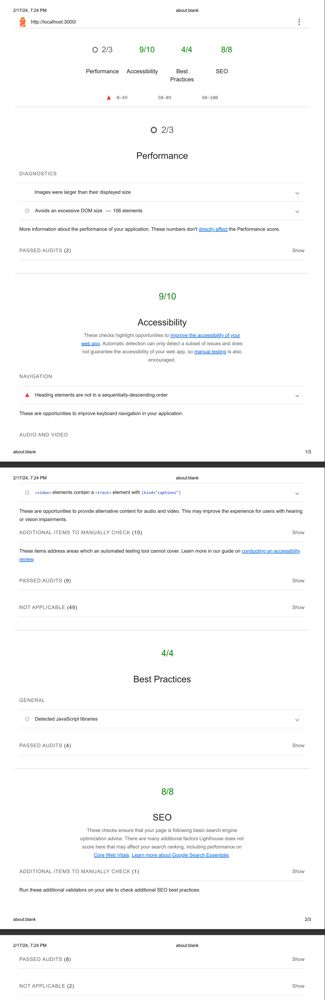

# React Video Player App

## Objective
Create a Video Player application using React.js to allow users to play videos from a playlist. The app should support features like seeking, timer, autoplay, and speed selector. Additionally, users should be able to reorder the playlist.

## Setup and Running

Before running the app, make sure you install node js in your machine.
1. Clone the repository.
2. In your cloned project directory open a terminal and Install dependencies using `npm install` command.
3. Start the developement server using `npm start` command in within the same directory.

## App URL's

1. [Live URL](https://rigivideoplayer.netlify.app/)
2. [GitHub Link](https://github.com/ShalemSamRaj/Rigi-Player)

## Requirements
1. **Video Player Component:**
   - Implement a video player with essential functionalities:
     - Play/Pause toggle.
     - Seek functionality.
     - Timer displaying current time and duration.
     - Autoplay.
     - Speed selector for playback speed adjustment.

2. **Playlist Component:**
   - Develop a playlist component to display and manage videos.
   - Allow users to reorder videos in the playlist.
   - Clicking on a video in the playlist should load and play that video in the video player.

3. **React State Management:**
   - Use React state / context to manage video playback, playlist state, and other necessary variables.

4. **Styling:**
   - Utilize Tailwind CSS or styled-components for styling.
   - Ensure a clean and user-friendly interface.

## Tech Stack
- React.js
- Tailwind CSS

## Bonus Features (Optional)
- Implement additional features such as fullscreen mode, volume control, thumbnail previews, or search/filter functionality for the playlist.
- Make the application responsive for various screen sizes.
- Re-Order the playlists using drag and drop

## LightHouse Report

  
## Contributing
Contributions are welcome! Feel free to submit issues or pull requests.

## License
This project is licensed under the [MIT License](LICENSE).

